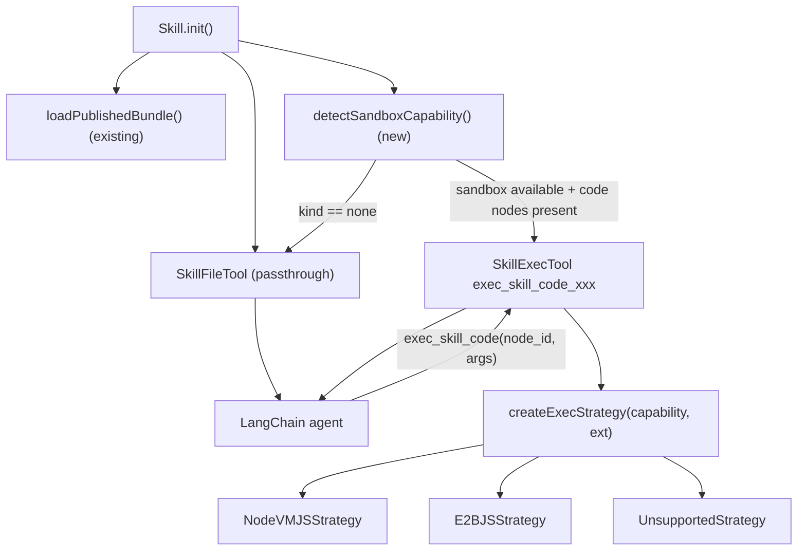

# Skill V2 — Call Strategy & Sandbox Execution Plan

> Status: **design — not yet implemented.** This doc specifies the
> contract, the tool topology, and the rollout for adding
> JavaScript execution to the Skill V2 runtime. It is the companion
> to [`docs/skill-v2/PLAN.md`](./PLAN.md) §8 and the Dify reference in
> [`docs/dify_project/skill_invocation.md`](../dify_project/skill_invocation.md).

---

## Table of contents

1. [Motivation](#1-motivation)
2. [Scope](#2-scope)
3. [Capability detection](#3-capability-detection)
4. [Companion tool: `SkillExecTool`](#4-companion-tool-skillexectool)
5. [Call-time strategy interface](#5-call-time-strategy-interface)
6. [Fallback semantics when no sandbox](#6-fallback-semantics-when-no-sandbox)
7. [Node input changes on `Skill.ts`](#7-node-input-changes-on-skillts)
8. [Storage & bundle contract](#8-storage--bundle-contract)
9. [Security](#9-security)
10. [Integration with the recruiting example](#10-integration-with-the-recruiting-example)
11. [Relationship to legacy `callStrategy.ts`](#11-relationship-to-legacy-callstrategyts)
12. [Phased rollout](#12-phased-rollout)
13. [Test plan](#13-test-plan)
14. [Open questions](#14-open-questions)

---

## 1. Motivation

`SkillFileTool._call()` in
[`packages/components/nodes/tools/Skill/SkillFileTool.ts`](../../packages/components/nodes/tools/Skill/SkillFileTool.ts)
currently returns the pre-compiled markdown content verbatim:

```37:42:packages/components/nodes/tools/Skill/SkillFileTool.ts
    async _call(_input: string): Promise<string> {
        if (this.toolHint) {
            return `${this.content}\n\n${this.toolHint}`
        }
        return this.content
    }
```

When a skill such as
[`docs/example-testing/recruiting/resume-screener.md`](../example-testing/recruiting/resume-screener.md)
references
[`docs/example-testing/recruiting/scoring_algorithm.js`](../example-testing/recruiting/scoring_algorithm.js)
via `{{skill.<nodeId>}}`, the compiler resolves it to a **path
string** (e.g. `./scoring_algorithm.js`) — not to content, and not to
a runnable artefact. The LLM sees the path in its prompt but has no
way to execute the file because Flowise has no persistent sandbox VM
(unlike Dify — see
[`docs/skill-v2/PLAN.md`](./PLAN.md) §8).

The recruiting example makes the gap concrete: the scoring algorithm
is deterministic, cheap, and would give the LLM a baseline it can
reason over. Without execution, the LLM either hallucinates a score or
silently ignores the reference.

The legacy v1 SkillTool solved a conceptually similar multi-mode
problem with a factory of call strategies in
[`packages/components/nodes/tools/SkillTool/compiler/callStrategy.ts`](../../packages/components/nodes/tools/SkillTool/compiler/callStrategy.ts)
(`SimpleCallStrategy` / `AdvancedCallStrategy` / `DedicatedCallStrategy`).
V2 wants the same ergonomics — a thin factory + a small `IStrategy`
interface — but applied to a different axis: **language runtime**.

---

## 2. Scope

### In scope (v1 of this feature)

-   Executing **JavaScript** code files stored inside a published
    `SkillV2` bundle, triggered by an LLM tool call.
-   Reusing the existing `executeJavaScriptCode` helper in
    [`packages/components/src/utils.ts`](../../packages/components/src/utils.ts)
    (line 1599). That helper already handles both `@flowiseai/nodevm`
    (default) and E2B (`@e2b/code-interpreter`, when `E2B_APIKEY` is
    set), plus the full builtin/external dependency allowlist and
    timeout knobs.
-   A single new LangChain tool, `exec_skill_code_<skill_slug>`, exposed
    to agents alongside the existing per-file `SkillFileTool`s.
-   A small strategy pattern inside the companion tool that branches on
    the referenced file's extension and the detected sandbox
    capability.
-   Clean passthrough fallback when no sandbox is available.

### Explicitly out of scope

-   Python / bash / TS-that-requires-transpilation. `.py` and `.sh`
    files return a structured "language not yet supported" envelope.
-   Multimodal skill content (images, PDFs) — still handled only as
    path references, per
    [`docs/skill-v2/PLAN.md`](./PLAN.md) §8.4.
-   A separate `read_skill_asset` helper for `kind === 'data'`.
    Tracked as Phase 5 in §12 below.
-   Streaming stdout back to the LLM during a long-running invocation.
    First cut returns stdout once, after the process exits.
-   Cross-skill execution (calling code in skill B while running a tool
    bound to skill A). Disallowed by the existing bundle boundary.

---

## 3. Capability detection

A new helper
`detectSandboxCapability()` returns a discriminated union the rest of
the module branches on:

```ts
// packages/components/nodes/tools/Skill/strategies/capability.ts (new)
export type SandboxCapability =
    | { kind: 'e2b'; apiKey: string } // E2B_APIKEY present
    | { kind: 'nodevm' } // default: @flowiseai/nodevm in-process
    | { kind: 'none'; reason: string } // admin disabled or unusable env

export const detectSandboxCapability = (): SandboxCapability => {
    if (process.env.SKILL_V2_ALLOW_EXEC === 'false') {
        return { kind: 'none', reason: 'SKILL_V2_ALLOW_EXEC=false' }
    }
    const apiKey = process.env.E2B_APIKEY
    if (apiKey && apiKey.trim().length > 0) {
        return { kind: 'e2b', apiKey }
    }
    return { kind: 'nodevm' }
}
```

Rules:

-   `nodevm` is still a **real sandbox**, not a bypass. It uses
    `@flowiseai/nodevm` with the same builtin/external allowlists
    (`TOOL_FUNCTION_BUILTIN_DEP`, `ALLOW_BUILTIN_DEP`,
    `TOOL_FUNCTION_EXTERNAL_DEP`) and the same `SANDBOX_TIMEOUT` that
    `CustomTool` relies on
    ([`packages/components/nodes/tools/CustomTool/core.ts:107-127`](../../packages/components/nodes/tools/CustomTool/core.ts)).
-   `e2b` is preferred automatically when `E2B_APIKEY` is set, because
    `executeJavaScriptCode` already makes that switch internally.
-   `none` is the explicit opt-out. Admins who want to forbid in-process
    NodeVM execution (e.g. multi-tenant hosted deployments) set
    `SKILL_V2_ALLOW_EXEC=false`.

`detectSandboxCapability()` is called **once per `Skill.init()`**, not
per `_call()`, so the decision is stable for the life of a chatflow
instance.

---

## 4. Companion tool: `SkillExecTool`

### 4.1 Location and registration

-   New file: `packages/components/nodes/tools/Skill/SkillExecTool.ts`
    (sibling of the existing
    [`SkillFileTool.ts`](../../packages/components/nodes/tools/Skill/SkillFileTool.ts)).
-   Registered by
    [`Skill.init()`](../../packages/components/nodes/tools/Skill/Skill.ts)
    **after** the per-file `SkillFileTool`s are created, only when
    `detectSandboxCapability()` returns `kind !== 'none'` and the
    bundle contains at least one `kind === 'code'` node. If no code
    file is reachable from the selected skills, we don't register the
    tool (keeps the tool palette small).

### 4.2 LangChain shape

`SkillExecTool` extends LangChain's `DynamicStructuredTool`:

```ts
import { DynamicStructuredTool } from '@langchain/core/tools'
import { z } from 'zod'

const schema = z.object({
    node_id: z.string().uuid().describe('UUID of the code node inside the skill bundle'),
    args: z.array(z.string()).default([]).describe('Positional argv strings passed to the script (argv[2..])')
})
```

-   **Name**: `exec_skill_code_<skill_slug>` where `<skill_slug>` is
    `formatToolName(skill.name)` (see
    [`utils.ts#formatToolName`](../../packages/components/nodes/tools/Skill/utils.ts)).
    The slug suffix avoids name collisions when multiple `Skill` nodes
    are wired into the same chatflow.
-   **Description**: dynamically generated and includes the list of
    allowed node ids so the LLM can pick one without guessing. Example:

    > "Execute a code file from the `Recruiting` skill. Allowed files:
    > `scoring_algorithm.js` (`<uuid-1>`). Pass the file's node id and
    > optional argv strings. Returns `{stdout, stderr, exitCode}` JSON."

### 4.3 `_call` pipeline

```
SkillExecTool._call({ node_id, args })
  1. Validate node_id is in the per-tool allowlist (§7).
  2. Look up entry = bundle.entries[node_id]; reject if entry.kind !== 'code'.
  3. Reject if entry.extension ∉ { js, mjs, cjs }.
  4. Fetch source via fetchNodeSource(workspaceId, skillId, node_id, entry.source.contentDigest).
  5. Reject if source.length > MAX_EXEC_BYTES.
  6. strategy = createExecStrategy(capability, entry.extension).
  7. result = await strategy.execute(ctx).  // ctx = { nodeId, filename, extension, source, args, flow, variables, timeoutMs }
  8. Truncate stdout / stderr to MAX_OUTPUT_BYTES.
  9. Return JSON.stringify({ stdout, stderr, exitCode }) to the LLM.
```

All rejections return a structured JSON envelope (`{ error: string,
code: string }`) so the LLM can recover — we never throw through
LangChain's error surface unless the sandbox itself panics.

### 4.4 Why a companion tool, not an in-`_call` strategy

-   `SkillFileTool._call(input: string)` has no room to accept
    structured args; changing its signature breaks LangChain's `Tool`
    contract.
-   Companion tool mirrors what
    [`docs/skill-v2/PLAN.md`](./PLAN.md) §8.5 already sketches
    (`exec_skill_code`) and is analogous to Dify's bash-tool pattern in
    [`docs/dify_project/skill_invocation.md`](../dify_project/skill_invocation.md)
    Step 3.
-   Keeps `SkillFileTool` tiny, preserves the current passthrough
    behaviour for non-sandbox environments, and gives operators an
    explicit toggle that's easy to document and audit.

### 4.5 Topology diagram



---

## 5. Call-time strategy interface

New module tree:
`packages/components/nodes/tools/Skill/strategies/`:

```
strategies/
├── capability.ts           # detectSandboxCapability()
├── index.ts                # createExecStrategy(capability, extension)
├── types.ts                # ExecCtx, ExecResult, IExecStrategy
├── NodeVMJSStrategy.ts
├── E2BJSStrategy.ts
└── UnsupportedStrategy.ts
```

### 5.1 Types

```ts
// strategies/types.ts
import type { ICommonObject, IVariable } from '../../../../src/Interface'

export interface ExecCtx {
    nodeId: string
    filename: string
    extension: string // 'js' | 'mjs' | 'cjs' (v1)
    source: string
    args: string[]
    flow: ICommonObject // mirrors CustomTool's flow object
    variables: IVariable[]
    timeoutMs: number
}

export interface ExecResult {
    stdout: string
    stderr: string
    exitCode: number
}

export interface IExecStrategy {
    execute(ctx: ExecCtx): Promise<ExecResult>
}
```

### 5.2 Concrete strategies

**`NodeVMJSStrategy`** — wraps user source as an async IIFE that
exposes `skill.args` and a captured `console.log`/`console.error`
buffer, then delegates to `executeJavaScriptCode`:

```ts
// strategies/NodeVMJSStrategy.ts (sketch)
import { createCodeExecutionSandbox, executeJavaScriptCode } from '../../../../src/utils'
import type { ExecCtx, ExecResult, IExecStrategy } from './types'

export class NodeVMJSStrategy implements IExecStrategy {
    async execute(ctx: ExecCtx): Promise<ExecResult> {
        const outChunks: string[] = []
        const errChunks: string[] = []

        const additionalSandbox: Record<string, unknown> = {
            $skill: {
                nodeId: ctx.nodeId,
                filename: ctx.filename,
                args: ctx.args
            }
        }

        const sandbox = createCodeExecutionSandbox('', ctx.variables, ctx.flow, additionalSandbox)

        // Simulate a Node CLI: the user code is wrapped in an IIFE whose
        // process.argv is { 'node', filename, ...args }, with stdout/stderr
        // captured into local buffers.
        const wrapped = `
            const __args = $skill.args || [];
            const process = { argv: ['node', $skill.filename, ...__args], env: {}, cwd: () => '/' };
            const __stdout = [];
            const __stderr = [];
            const console = {
                log:  (...x) => __stdout.push(x.map(v => typeof v === 'string' ? v : JSON.stringify(v)).join(' ')),
                error:(...x) => __stderr.push(x.map(v => typeof v === 'string' ? v : JSON.stringify(v)).join(' '))
            };
            ${ctx.source}
            return { stdout: __stdout.join('\\n'), stderr: __stderr.join('\\n'), exitCode: 0 };
        `

        try {
            const result = await executeJavaScriptCode(wrapped, sandbox, {
                useSandbox: true, // auto-selects E2B when E2B_APIKEY set
                timeout: ctx.timeoutMs
            })
            return {
                stdout: String(result?.stdout ?? ''),
                stderr: String(result?.stderr ?? ''),
                exitCode: Number(result?.exitCode ?? 0)
            }
        } catch (err: any) {
            return { stdout: outChunks.join('\n'), stderr: String(err?.message ?? err), exitCode: 1 }
        }
    }
}
```

The user's code is wrapped so a CJS-style `module.exports = function () {
... }` style also works, but the primary contract is: **the user
may write arbitrary statements; stdout from `console.log` is captured**.
(Details nailed down in the implementation PR; the design doc only
pins the observable shape.)

**`E2BJSStrategy`** — same entry point as `NodeVMJSStrategy`, but
exists as a separate class so observability (logs, telemetry) can
distinguish which backend ran. Since `executeJavaScriptCode` already
selects E2B internally when `E2B_APIKEY` is set, the body can be a
thin delegate to `NodeVMJSStrategy` for the v1 cut; future phases
can push stream handling or E2B-specific primitives into it.

**`UnsupportedStrategy`** — returned when the extension is
non-JavaScript:

```ts
// strategies/UnsupportedStrategy.ts
export class UnsupportedStrategy implements IExecStrategy {
    async execute(ctx: ExecCtx): Promise<ExecResult> {
        return {
            stdout: '',
            stderr:
                `Skill V2 exec does not support .${ctx.extension} files yet. ` +
                `Read the source via a data-file reference or handle it in prompt text.`,
            exitCode: 127
        }
    }
}
```

### 5.3 Factory

```ts
// strategies/index.ts
import type { SandboxCapability } from './capability'
import type { IExecStrategy } from './types'
import { NodeVMJSStrategy } from './NodeVMJSStrategy'
import { E2BJSStrategy } from './E2BJSStrategy'
import { UnsupportedStrategy } from './UnsupportedStrategy'

const JS_EXTS = new Set(['js', 'mjs', 'cjs'])

export const createExecStrategy = (capability: SandboxCapability, extension: string): IExecStrategy => {
    if (capability.kind === 'none') return new UnsupportedStrategy()
    if (!JS_EXTS.has(extension.toLowerCase())) return new UnsupportedStrategy()
    if (capability.kind === 'e2b') return new E2BJSStrategy()
    return new NodeVMJSStrategy()
}
```

Shape copies legacy
[`createCallStrategy`](../../packages/components/nodes/tools/SkillTool/compiler/callStrategy.ts)
intentionally — small registry, no dynamic registration, easy to
read and unit test.

---

## 6. Fallback semantics when no sandbox

-   `detectSandboxCapability()` returns `{ kind: 'none' }`.
-   `Skill.init()` **does not register** `SkillExecTool` at all. Its
    slot is empty; the agent never sees an exec tool in its tool list.
-   The per-file `SkillFileTool` remains unchanged: it returns
    `this.content` exactly as it does today.
-   `buildToolHint()`
    ([utils.ts#buildToolHint](../../packages/components/nodes/tools/Skill/utils.ts#L116))
    appends a new single-line note when two conditions are met
    (capability is `none` **and** the file's transitive `files.references`
    contain at least one `kind === 'code'` node):

    > "Note: code files are referenced by path only; execution is
    > disabled on this server."

-   This is strictly metadata. **The compiled bundle content is not
    rewritten.** Nothing about the bundle artefact changes; the hint
    only affects the runtime `_call` output.

Operator runbook consequence: to enable execution, the operator either
leaves `SKILL_V2_ALLOW_EXEC` unset (default NodeVM) or sets
`E2B_APIKEY` (auto-selects E2B). No migration, no republish needed.

---

## 7. Node input changes on `Skill.ts`

New UI inputs on the existing `Skill` node
([Skill.ts#inputs](../../packages/components/nodes/tools/Skill/Skill.ts)):

| Input name          | Type                | Default | Purpose                                                                                                                                                                                         |
| ------------------- | ------------------- | ------- | ----------------------------------------------------------------------------------------------------------------------------------------------------------------------------------------------- |
| `sandboxExec`       | `options`           | `auto`  | `auto \| on \| off`. `auto` follows `detectSandboxCapability`. `off` hides the companion tool even if a sandbox is available. `on` forces registration and errors at init if `kind === 'none'`. |
| `execNodeAllowlist` | `asyncMultiOptions` | `[]`    | Code nodes (filtered by `kind === 'code'`) the companion tool is allowed to execute. Empty list = **all code nodes** in the bundle. Loader reuses the same tree walk as `listSkillFiles`.       |
| `execTimeoutMs`     | `number`            | `5000`  | Per-invocation timeout in ms. Upper-bounded at init time against `SANDBOX_TIMEOUT` (env). Values above the bound are clamped and logged.                                                        |

Why these three and not more:

-   `sandboxExec=off` is the single-switch kill-switch an author needs
    when a skill carries code they don't want the LLM to actually run
    (e.g. reference-only examples).
-   `execNodeAllowlist` is the surface for fine-grained intent: it maps
    1-to-1 to the existing `listSkillFiles` picker pattern.
-   `execTimeoutMs` keeps tail latency in the author's hands; most test
    scripts finish in <500 ms.

No input needs to change on `SkillFileTool` itself.

---

## 8. Storage & bundle contract

### 8.1 No bundle schema change

Raw source for `kind === 'code'` nodes **stays out of `bundle.json`**.
The current
[`SkillBundleEntry`](../../packages/components/nodes/tools/Skill/utils.ts#L41)
contract — `content: ''` for non-skill kinds — is preserved. This
keeps the published bundle compact (a 10 MB JS file would otherwise
bloat every LLM node's memory cache).

### 8.2 Lazy source fetch

Sources are read on demand at exec time via `getFileFromStorage`, the
helper that
[`bundleLoader.ts`](../../packages/components/nodes/tools/Skill/bundleLoader.ts)
already uses to read `bundle.json`:

```ts
// fetchNodeSource (new helper colocated with bundleLoader.ts)
const buf = await getFileFromStorage(`${nodeId}.json`, 'skills-v2', workspaceId, skillId, 'nodes')
const payload = JSON.parse(buf.toString('utf8')) as { content: string }
return payload.content
```

The layout matches the server-side writer in
[`packages/server/src/services/skills-v2/SkillV2Storage.ts`](../../packages/server/src/services/skills-v2/SkillV2Storage.ts)
(`putNodeJson`). No migration is needed.

### 8.3 Small LRU

A process-local LRU is added around `fetchNodeSource`, keyed by
`(workspaceId, skillId, nodeId, contentDigest)`. Cache size capped to
32 entries; TTL 24 h; same shape as `bundleLoader.ts`'s `memoryCache`.
The digest in the key means a re-publish with new content
auto-invalidates the cache without any explicit wiring.

### 8.4 Bundle-entry enrichment for description

`SkillExecTool`'s description enumerates the allowed nodes. To build
that string we need, at init time, `(nodeId, path, extension)` for every
code node reachable from the selected skills. The bundle already
exposes this via `entry.kind` + `entry.path`, so no additional lookup
is required.

---

## 9. Security

### 9.1 Allowlist

-   Deny execution of any `node_id` whose `entry.kind !== 'code'`.
-   Deny execution when the node's extension is not in a fixed set:
    `{ js, mjs, cjs }` for v1. This is a hard list inside the factory;
    it is **not** user-configurable.
-   Deny execution when the `node_id` is outside the per-tool
    `execNodeAllowlist` (when set).

### 9.2 Resource limits

-   Per-invocation timeout: `min(execTimeoutMs, SANDBOX_TIMEOUT)`; the
    clamp is logged once at init.
-   `MAX_EXEC_BYTES = 256 KiB` for the source (counted on the raw
    payload before wrapping).
-   `MAX_OUTPUT_BYTES = 16 KiB` each for stdout and stderr. Excess is
    truncated with a trailing `… [truncated]` marker. Mirrors Dify's
    bash truncation in
    [`docs/dify_project/skill_invocation.md`](../dify_project/skill_invocation.md)
    Step 4.

### 9.3 Sandbox isolation

-   `NodeVMJSStrategy` inherits `createCodeExecutionSandbox`'s allowlist
    contract from
    [`CustomTool/core.ts`](../../packages/components/nodes/tools/CustomTool/core.ts),
    so all existing `TOOL_FUNCTION_BUILTIN_DEP` /
    `TOOL_FUNCTION_EXTERNAL_DEP` / `ALLOW_BUILTIN_DEP` knobs apply
    transparently. No new env vars beyond `SKILL_V2_ALLOW_EXEC`.
-   No filesystem writes exposed in NodeVM mode (no `fs` mock is
    provided in our sandbox). E2B mode's writes go to the ephemeral
    container only.
-   The sandbox receives `$skill.args` and the normal Flowise `$flow` /
    `$vars` object, exactly like `CustomTool`. It never receives the
    full `bundle.json` or storage credentials.

### 9.4 Path-traversal

`node_id` is always a UUID, never concatenated into a filesystem
path beyond `getFileFromStorage`'s own whitelist. The helper rejects
separators in the `fileName` argument, which covers the only untrusted
segment in the call.

### 9.5 Error envelope

Every rejection returns structured JSON to the LLM:

```json
{ "error": "node_id not allowed", "code": "SKILL_V2_EXEC_FORBIDDEN" }
```

Codes: `NOT_CODE`, `UNSUPPORTED_EXT`, `OVERSIZE`, `TIMEOUT`,
`SANDBOX_ERROR`, `FORBIDDEN`, `NOT_FOUND`. The LLM can branch on
them; operators can grep for them in logs.

---

## 10. Integration with the recruiting example

Concrete wiring for the existing
[`docs/example-testing/recruiting/`](../example-testing/recruiting/)
asset bundle:

1. Author uploads the files as described in
   [`docs/example-testing/README.md`](../example-testing/README.md).
2. Operator leaves `SKILL_V2_ALLOW_EXEC` unset, no `E2B_APIKEY`.
   `detectSandboxCapability()` returns `{ kind: 'nodevm' }`.
3. Author publishes the `Recruiting` skill. The bundle has:
    - `resume-screener.md` (skill, references `./scoring_algorithm.js`)
    - `interview-questions.md` (skill)
    - `email-drafter.md` (skill)
    - `job-description.txt` (data)
    - `scoring_algorithm.js` (**code**, reachable from
      `resume-screener.md`)
4. A chatflow wires the `Skill` tool node at
   `Recruiting` → `resume-screener.md`. At init time, `Skill.init()`:
    - Creates one `SkillFileTool` named `resume_screener`
      (unchanged).
    - Detects `kind: 'nodevm'` and at least one code node in the
      transitive closure → creates one `SkillExecTool` named
      `exec_skill_code_recruiting`. Description lists:
      `scoring_algorithm.js (<uuid>)`.
5. At runtime the agent invokes `resume_screener`. The returned
   markdown references `./scoring_algorithm.js` as before. The agent
   then decides to call:

    ```json
    {
        "name": "exec_skill_code_recruiting",
        "arguments": {
            "node_id": "<scoring_algorithm.js uuid>",
            "args": ["<resume text>", "<jd text>"]
        }
    }
    ```

6. `SkillExecTool._call` fetches the source, runs it under
   `NodeVMJSStrategy`, and returns:

    ```json
    {
        "stdout": "{\n  \"technical_fit\": 7.3,\n  \"experience_level\": 8,\n  \"culture_fit\": 7,\n  \"overall\": 7.4\n}\n",
        "stderr": "",
        "exitCode": 0
    }
    ```

7. The agent reuses the numeric baseline in its final screening
   report, alongside its own qualitative assessment. Exactly mirrors
   the Dify walkthrough's Step 3 "ROUND 2" in
   [`docs/dify_project/skill_invocation.md`](../dify_project/skill_invocation.md).

Follow-up doc task (not part of this plan's deliverable): extend
[`docs/example-testing/README.md`](../example-testing/README.md) §6
and
[`docs/example-testing/test-prompts.md`](../example-testing/test-prompts.md)
§1 to point at this call-strategy doc and add an "exec mode" test
case.

---

## 11. Relationship to legacy `callStrategy.ts`

-   **Not reused.** We imitate the factory + interface pattern from
    [`packages/components/nodes/tools/SkillTool/compiler/callStrategy.ts`](../../packages/components/nodes/tools/SkillTool/compiler/callStrategy.ts)
    and keep v2's strategies under a separate tree
    (`packages/components/nodes/tools/Skill/strategies/`). No runtime
    or type coupling.
-   **Different axis.** The legacy strategies (`simple`, `advanced`,
    `dedicated`) keyed on _folder mode_ (i.e. how content was compiled).
    V2 keys on _language runtime_ (i.e. how code is executed). The two
    sets don't map onto each other.
-   **Rationale for not extending legacy.** The legacy module lives
    inside v1's compiler tree and depends on v1-specific types
    (`SkillNodeInput`, `SkillEdgeInput`, `NodeCompileConfig`). Reusing
    it would drag the whole v1 compiler in. The per-file topology and
    the bundle-based caching model in v2 are too different to bridge
    cleanly.

---

## 12. Phased rollout

| Phase | Scope                                                                                                                                                                       | Gating flag           |
| ----- | --------------------------------------------------------------------------------------------------------------------------------------------------------------------------- | --------------------- |
| 1     | This design doc.                                                                                                                                                            | —                     |
| 2     | `SkillExecTool` + `NodeVMJSStrategy` + `detectSandboxCapability` + factory. Hard-coded `SKILL_V2_ALLOW_EXEC` env var, **default `false`** on main, `true` in dev.           | `SKILL_V2_ALLOW_EXEC` |
| 3     | Wire `sandboxExec` / `execNodeAllowlist` / `execTimeoutMs` inputs into `Skill.ts`; ship the three UI controls. Flip the default of `SKILL_V2_ALLOW_EXEC` to `true` on main. | —                     |
| 4     | `E2BJSStrategy` refinements (streaming stdout, explicit language hint, richer error envelope) when `E2B_APIKEY` is set.                                                     | —                     |
| 5     | Companion `read_skill_asset` helper for `kind === 'data'` (lets the LLM read `.txt` / `.json` / `.csv` contents without exec). Tracked in a follow-up plan.                 | —                     |

Phases 2 and 3 are a single merge train in practice; the split
exists so the env-flagged version can bake on staging for a release
cycle before UI surfaces it.

---

## 13. Test plan

### 13.1 Unit tests

-   `detectSandboxCapability`: toggles over the three env permutations
    (`SKILL_V2_ALLOW_EXEC=false`, `E2B_APIKEY=set`, neither) and
    asserts the returned discriminant.
-   `createExecStrategy`: 3×3 table over
    `(capability, extension) ∈ { none, nodevm, e2b } × { js, py, txt }`.
    Every cell returns the class the table expects.
-   `NodeVMJSStrategy.execute`: runs
    [`scoring_algorithm.js`](../example-testing/recruiting/scoring_algorithm.js)
    against a fixed resume/JD pair; asserts `exitCode === 0`, `stdout`
    parses to JSON, and `technical_fit`/`overall` match a hand-computed
    baseline within ±0.1.
-   Output truncation: a strategy that emits 32 KiB is truncated to
    16 KiB + marker suffix.
-   Oversize source: `MAX_EXEC_BYTES + 1` source rejects with
    `code: OVERSIZE`.

### 13.2 Integration tests

-   Full chatflow harness: drop a `Skill` node pointed at
    [`docs/example-testing/recruiting/`](../example-testing/recruiting/),
    drive it with a model stub that always emits one
    `exec_skill_code_recruiting` call. Assert:
    -   The exec tool is present in the agent's tool list (only when
        capability is non-`none`).
    -   The stdout payload reaches the final agent output.
    -   Disabling `sandboxExec=off` hides the tool even though
        `NODEVM` is available.
-   Allowlist behaviour: `execNodeAllowlist` set to a single node →
    calls to other code nodes return `code: FORBIDDEN`.

### 13.3 Negative tests

-   `node_id` points at a `.md` node → `code: NOT_CODE`.
-   `node_id` points at a `.py` node → `code: UNSUPPORTED_EXT`.
-   Source deliberately runs `while(true)` → timeout triggers and
    returns `code: TIMEOUT` without crashing the worker.
-   `getFileFromStorage` fails → `code: NOT_FOUND` with the original
    storage error in logs but not in the response.

### 13.4 Observability

-   Structured log on every `_call`:
    `skill_v2_exec { capability, nodeId, ext, durationMs, exitCode, truncated }`.
-   Counter metric `skill_v2_exec_total{result=…}` (one of
    `ok | forbidden | timeout | sandbox_error | oversize | not_found`).

---

## 14. Open questions

-   **Stdin.** Should `exec_skill_code` accept stdin content (e.g. a
    candidate-resume blob) as a dedicated schema field, or force the
    LLM to pass everything via `args`? Current preference: **args-only
    for v1** — mirrors how the LLM already thinks of CLI invocations
    and avoids a second schema field that competes with `args`. Revisit
    if scripts frequently need >a few KB of input.
-   **UI surfacing of exec logs.** Where do we surface stdout/stderr in
    the Flowise run-history? Likely via the existing callback-manager
    trace (same channel `CustomTool` uses), but the implementation
    ticket needs to confirm the exact hook and whether the LLM's own
    trace also needs the truncated payload.
-   **Interaction with future `readSkillAsset`.** Phase 5's data-read
    helper will want the same `(node_id)` schema convention. We should
    coordinate the two tool names (`exec_skill_code_xxx` and
    `read_skill_asset_xxx`) so the LLM's mental model stays simple.
    Out of scope for this plan, tracked separately.
-   **Cycles between exec and further LLM turns.** If the agent calls
    `exec_skill_code` → `resume_screener` → `exec_skill_code` again,
    nothing stops it today. Do we want a per-call budget? Probably yes,
    but deferred: the existing agent-step budget already bounds the
    conversation.
